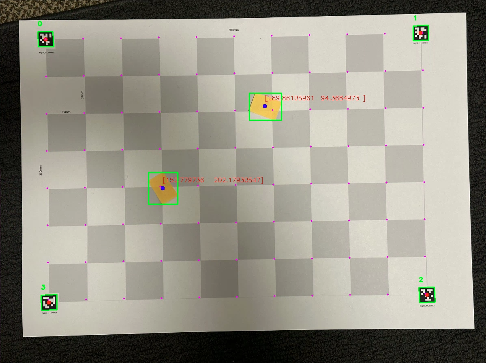

# Visual localization using odometry

In many systems, an camera is used to locate and track objects. In the last
project, we investigated systems to determine where the robot is in the world
space. In this project, I investigated ways to determine an object's location in
space visually.

### Goal

The purpose of this project was to find the location of objects in the world
space. One guiding aid I added was the use of Fiducial tags with known locations
to help compute the locations of the objects.

### Methodology

##### Setup used

I designed a test setup and printed it using the poster printer in the library.
This test setup features four fiducial tags set up at the corners, precisely
spaced out in a rectangular pattern. In addition, to aid the testing, a grid of
50mm squares was placed in between all of the fiducial tags. The library's
poster printer allowed me to print this at a 1:1 scale on A2 sized paper, which
was plenty big enough to test multiple arrangements.

While object detection is an interesting part of computer vision, for this
project, I decided to make the object detection as simple as possible. To do
this, the objects I chose were orange sticky notes. As the setup was completely
grayscale, the orange sticky notes stand out and can easily be detected with HSV
thresholding, which is a technique I am already familiar and comfortable with.

All of the test images were taken using my iPhone, then transferred to the
computer to run the algorithm on.

Below is a picture of the setup:

##### Fiducial tags

The fiducial tags chosen were pregenerated
[apriltags](https://github.com/AprilRobotics/apriltag). These are common
fiducial markers that have broad support from their [Python
library](https://pypi.org/project/apriltag/). This library takes a greyscale
image and searches for the tags, which all have unique IDs. Because the
apriltags are placed in known locations and they are all unique, we can
corrolate the tag detection locations with known locations in the world frame.

##### Object detection

Object detection was done using HSV thresholding. This is a simplistic method of
object detection solely from the color data in the image. However, because the
entire image is shades of grey and the post its are the only color, this is a
very effective method of searching. First, we convert the image into HSV. This
allows us to search in a color space that is more descriptive of the color value
than a color space that is optimized for displaying on a screen. Then, we
compare the image matrix to predetermined bounds on the hue, saturation, and
brightness values. These bounds were tuned so that only the post it notes were
in those bounds. Finally, an OpenCV method `findContours` was used on the
boolean matrix to locate each of the objects detected.

##### Object Localization

The contours were used to locate the objects in the image space. The challenge,
then, is to compute the transformation from the image space to the world space.

To do so, a homography matrix is used. Homography is a technique used to compute
the position of a point from one camera's space to another camera's space.
However, instead of transforming to another camera's space, here, the second
camera is a hypothetical camera that is placed so that the center of the camera
frame is at the center of the board, the camera's direction is normal to the
board, and that one pixel in that camera space is equivolent to one millimeter
in the world space.

This can be computed by using a system of equations, where the matrix `A = [x y]` in
the world frame, `B = [x y]` in image space. We want to compute a matrix `H`
where `A = H dot B` for every pair of A and B for each fiducial tag.
Convienently, OpenCV provides a `findHomography` function that solves this
system of equations.

Finally, to compute an object's location in world space, we can use this matrix
`H` to compute the world position from any position in the image.

##### Debugging

One technique used to debug this system was to overlay a dot grid on top of the
image. This dot grid was computed by using the inverse of the homography matrix,
and was spaced out to fit exactly in line with the grid on the paper. Before the
object detection was implemented and tuned, this was used to quickly test that 
the homography matrix worked.

##### Output

Below is what the program output. The objects' final locations were overlaid as
text onto the image, and visually, they look close to the correct position as
measured by the grid.

### Challenges faced

One of the challenges faced in this project was developing things in the wrong
order. The first thing I decided to work on was the fiducial tags, which was
derisked early using the apriltag library. However, the logical next step was to
understand and use the homography method in OpenCV. Unfortunately, there was no
way to check the outputs of the algorithm against ground truth in the moment.
This prompted work to start on the object detection. However, the energy to
context switch to a different part of the code made it significantly harder to
pick back up on validating the homography code. Object detection was straight
forward but required a lot of trial and error to get just right. Half way
through, I decided to stop trying to get the object detection working together
with the homography all at once and decided to overlay the dot grid instead,
which allowed me to prove out the homography first, then go back to the object
detection.

This was a very disorganized process that required me to keep track of where my
headspace was at in two different parts of the project at the same time. This
all could have been avoided by spending ten minutes before starting the entire
project making sure I had a solid plan before diving into the code.

### Future improvements

One thing that is missing in this version of the code was accounting for the
distortion in the camera's lens. Visually, the dots overlaid on the image were
all close, and while the overlaid grid was all straight lines, the image's lines
themselves were not always straight, especially near the edges of the image.
This is normal for lens distortion, but there was nothing in the code that
accounted for that.

In addition, I recently found that there is another method in OpenCV that is
used to calibrate the camera. However, this requires a checkerboard that I did
not have time to print out at the library.

